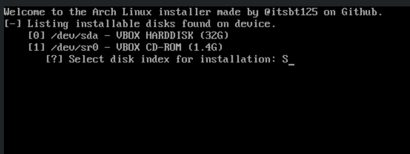
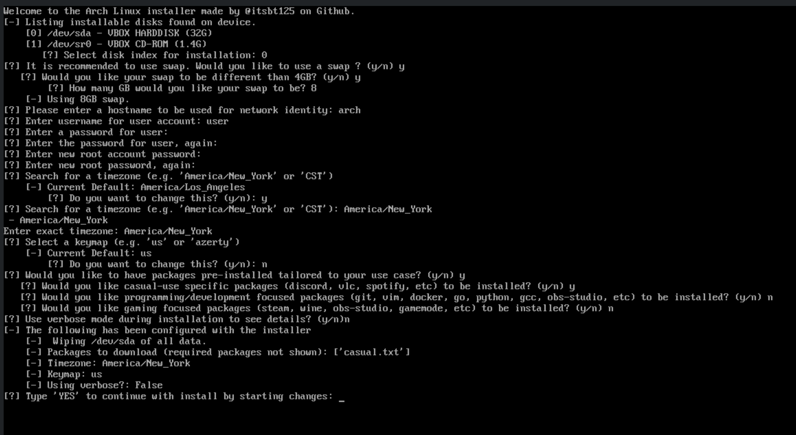
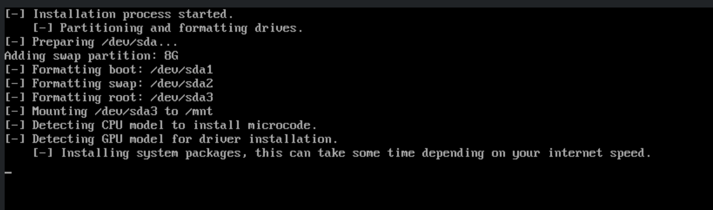
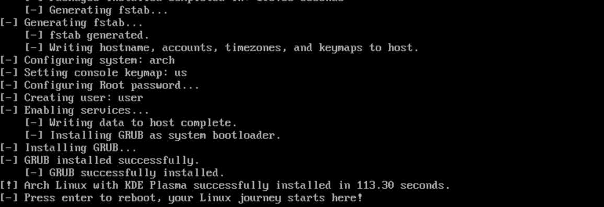
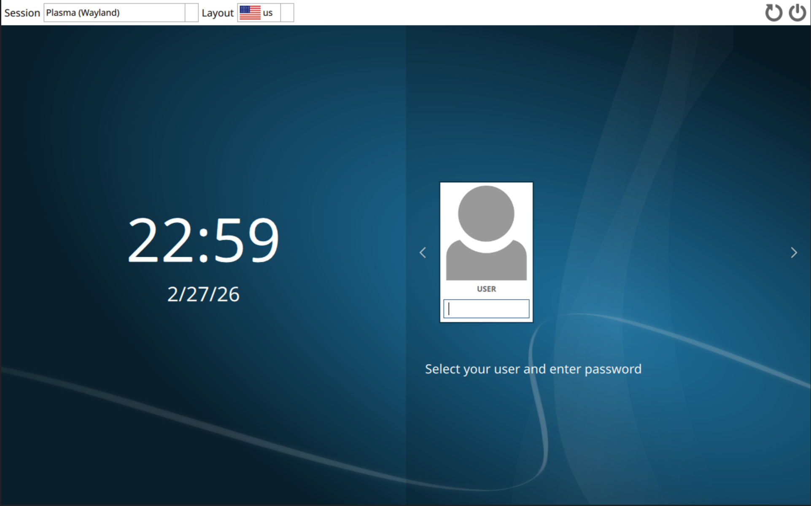

**Arch Linux CLI Installer**

An intuitive, Python 3-based command-line installer for Arch Linux, built with beginners in mind.
This tool allows you to configure and install Arch with ease while setting up a functional [KDE Plasma](https://kde.org/plasma-desktop/) environment automatically. It removes the complexity Arch is known for while keeping the lightweight nature of the OS.

Usage steps:
1. Boot into the Arch Linux live environment using your installation medium.
2. If Ethernet is unavailable, connect to the internet using `iwctl` for WiFi. It's recommended to check the [ArchWiki](https://wiki.archlinux.org/title/Iwd) page for this.
3. Run the following one-line command ```pacman -Sy git --noconfirm && git clone https://github.com/itsbt125/Arch-Linux-CLI-Installer && cd Arch-Linux-CLI-Installer && python main.py```

Note(s):
1. I haven't added dual boot support yet, `disks.py` is made with a full format of the selected drive in mind. Dual boot support is coming soon.
2. Alternative desktop environment selection will also be available in the near future!

     
